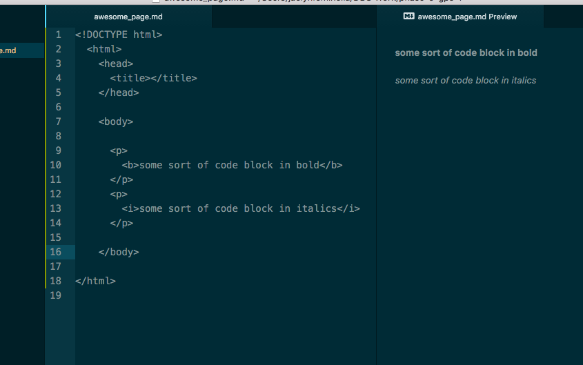

<!DOCTYPE html>
  <html>
    <head>
      <title></title>
    </head>

    <body>

      

        <b>some sort of code block in bold</b>
      

      

        <i>some sort of code block in italics</i>
      

      

        
      

      

        <a href="http://www.huffingtonpost.com/" Huffington Post>
      

      
    </body>

</html>
